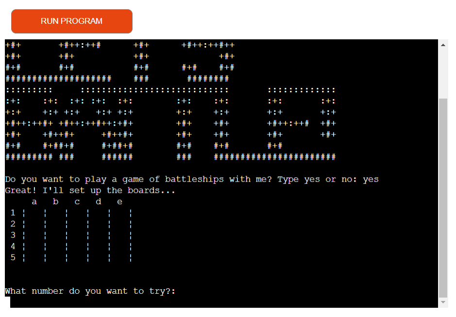

# Welcome to You Sunk My Battleship

You Sunk My Battleshp is a tribute to the popular traditional game of <a href="https://en.wikipedia.org/wiki/Battleship_(game)#:~:text=Battleship%20is%20known%20worldwide%20as,device%20apps%20and%20a%20film">Battleships</a>, the ultimate in simple strategy gaming.

Battleships can be played with just a paper and pen but it has grown into much more since it's inception during World War I. Now expanded to board games, electronic games and even a film, it is an enduring classic. This version offers basic game play in which the player must try and "sink" the ships on the board by guessing their position with a limited number of turns.

This game is a demonstration of my Python skills as required by Portfolio 3 Assessment as part of the Code Institute Diploma in Full Stack Software Development.

 
<strong>The deployed game can be found <a href="https://skod-you-sunk-my-battleship.herokuapp.com/">here</a>.
</strong>
 

 

## How to play

Battleships are placed on a board and hidden from the player. They must guess where on the board they think the battelship is placed. First, typing a number corresponding to the x axis then hitting enter on their keyboard. Then followed by a letter corresponding to the y axis and the enter key. If the guess is correct, they have hit and sunk a battleship!

Players are limited to 8 torpedoes (or turns) in which to try and destroy all the battleships and win the game.

If they are successful, they will be rewarded with an ASCII display. If they run out of torpedoes, they will be prompted to try again in a new game.

 

## Wireframing & Planning

Before development began, online chart builder <a href="https://lucid.app/documents#/dashboard">Lucid</a> was used to map out the game and how best to approach it. It helped to work through the steps needed to make the game make sense to the user and what tasks the code should execute.

 

 

## Features
### Existing
<ul>
<li>Generates board</li>
<li>Places battleships in random positions on board</li>
<li>Keeps score</li>
<li>Limits player turns</li>
<li>Offers rematch</li>
</ul>
 

### Future
<ul>
<li>Boat number/board size choice</li>
<li>Two player mode</li>
<li>Custom player naming</li>
</ul>
 

## Data Model

For this game, two classes were used; one for the board and one for the ships. Using two classes for main elements of the game could help additional features being added later without disrupting the way the game currently runs.

 

### BattleshipBoard

This class is used to generate the board during the gameplay. As the user adds their guesses to the board it's used up to 8 times in one game.

 

### Battleships

This class handles the position of the ships on the board and the users entries including validation and checking if the turn was a "hit". Similar to the BattleshipBoard class, Battleship is used at least 8 times, more if the user repeatedly enters an incorrect value when guessing.

 

## Bugs

Fixed

<ul>
    <li><strong>Formatting:</strong> Although all the characters were working, the layout of the board was broken when using an f-string to format it. Using formatting placeholders may not actually be the optimal approach but were the best resolution at the time of submission. This should be reviewed.</li>
    <li><strong>Run game:</strong> After putting together the elements of the game, it would not run. Definitions and functions were checked by printing to the terminal but did not uncover any issues. Reviewing this solution demonstrated that the main function to run the script was missing.</li>
    <li><strong>Line 118:</strong> The original approach compared the two possibilities of a placement on the board being occupied by a hit (X) or a miss (-) within a while loop. This caused a line length error so variables were added to declare what a hit or miss is. Unfortunately this broke the loop and the user was caught in the loop, even if their guess was valid. The original code was put back in place and then broken up using parenthesis to address the line length error, this should be reviwed in the next iteration of this game.</li>
</ul>
 

Unfixed

<ul>
    <li><strong>Rematch:</strong> The game offers the user a rematch; the first time the user is asked, if they type "yes" they are brought back into the game through the rematch code. The second time they are asked they are brought back in through the initial game play. Attempts to fix this resulted in broken loops. The decision was made to use the initial buggy code as the user isn't impacted. However, it could effect future iterations that include new features so it should be reviewed.</li>
</ul>
 

## Testing

This project was validated using PEP8 for Python 3. PEP8 is the industry standard that provides guidelines for styling Python code. It helps to keep programmes written in Python legible and maintained.

It should be noted that as the ships on the boards are randomly generated, it is difficult to test real game play of a winning game, especially with real users. To get around this, this section was tested by using print statements to the terminal.

<ul>
    <li><strong>Gitpod:</strong> Using Gitpod provided additional support when building this game. It flags errors and potential areas to improve as the code is written. This was particularly useful for ensuring indentation and line length were to PEP8 standard as the overall project developed.</li>
    <li><strong>Online PEP8 checkers:</strong> In addition to Gitpod, several online tools such as <a href="https://extendsclass.com/python-tester.html">Extends Class</a> were used to back up Gitpod validation during development. However, some of them were checking against older Python versions. This initially caused some confusion as they flagged code that was currently correct, such as the use of f-strings. Once the error was realised, the project was rechecked using an appropriate version and found no significant errors.</li>
    <li><strong>UAT: </strong>The game was tested in person with two users using a different device for each user. Without access to Apple devices, both used devices running Windows 10 using the Gitpod terminal. Users were encouraged to enter incorrect data. There were no issues found with the game play or how it was executed at this point.</li>
    <li><strong>Code Institute Python Linter:</strong> The Code Institute Python Linter was used as the final phase of testing before deployment. It showed some line lengths that could be improved and new variables or split lines were used to shorten them.</li>
    <li><strong>After deployment:</strong> Final testing was carried out after deployment both using the CI Python Linter and with a user. Although no errors were found with the code, the user uncovered that when they did not type "yes" or "no" successfully when asked for a rematch, it exited anyway. This was due to it being set up as "yes" or everything else with an if/else statement. By adding an elif for "no", this issue was resolved.</li>
</ul>
 

## Deployment

This project was deployed using <a href="https://dashboard.heroku.com/apps">Heroku</a> Cloud Platform. It uses the <a href="https://github.com/Code-Institute-Org/python-essentials-template">Code Institute Python template repo</a> to assist with successful deployment, as per project recommendations. This included tasks that are unique to this template that prepared the project for deployment to Heroku, such as adding \n to the end of input strings (please note that not all were required and were removed during after deployment testing).

To replicate the deployment, please follow the below steps.

### Steps for Deployment
<ul>
    <li>Log in to yoour Heroku account</li>
    <li>In the top right corner, click "New" then "New App"</li>
    <li>Name the app with a unique name</li>
    <li>Ensure the location is set to the relevant one</li>
    <li>Click create</li>
    <li>Go to settings</li>
    <li>Add relevant ConfigVars and Buildpacks; for this app it includes PORT: 8000 and python & node.js</li>
    <li>Go to deploy and choose a deployment method; for this app it is GitHub</li>
    <li>When using GitHub, type the name in the text field to find the repo</li>
    <li>Check the branch is correct</li>
    <li>Click connect</li>
    <li>App is deployed when the "View app" button appears</li>
</ul>
 

## Credits
### Background Support & Referencing:
<ul>
    <li><a href="https://learn.codeinstitute.net/courses/course-v1:CodeInstitute+PE_PAGPPF+2021_Q2/courseware/b3378fc1159e43e3b70916fdefdfae51/605f34e006594dc4ae19f5e60ec75e2e/">Portfolio Project 3 Scope</a> through Code Institute</li>
    <li><a href="https://www.youtube.com/watch?v=alJH_c9t4zw">Python Battleship with Object Oriented Programming</a> by Knowledge Mavens through Youtube</li>
    <li><a href="https://copyassignment.com/battleship-game-code-in-python/">Battleship Game Code in Python</a> by Pranjav Dev through Copy Assignment</li>
    <li><a href="https://bigmonty12.github.io/battleship">Python for Beginners: Battleship2</a> by Austin Montgomery through BigMonty1.github.io</li>
    <li><a href="http://www.figlet.org/examples.html">FIGlet</a> by Plig.net through Figlet.org</li>
</ul>
 

### Direct Sourcing:
<ul>
    <li><a href="https://www.geeksforgeeks.org/python-ascii-art-using-pyfiglet-module/">Python ASCII art using Pyfiglet Module</a> by Ankthon through Geek for Geeks - This is a straight forward method of inserting ASCII art into the project and there didn't appear to be justification for changing or complicating it.</li>
    <li><a href="https://www.youtube.com/watch?v=alJH_c9t4zw">Python Battleship with Object Oriented Programming</a> by Knowledge Mavens through Youtube - This tutorial helped resolve two bugs referenced in the Bugs section of this document; the f-string board bug and the gameplay bug</li>
    <li><a href="https://www.askpython.com/python/examples/exit-a-python-program">Exit a Python Programm in 3 Easy Ways</a> by AskPython.com - a break was used to stop game play after offering a rematch but this didn't acknowledge the user saying no to the new game. In looking for an alternative method to employ, this resource was discovered. The "quit" function was used as it is built in and doesn't require importing anything else to the game (compared to sys.exit for example). It is my understanding that this should only be used in scenarios such as student projects, where the code is not part of a larger, commercial project.</li>
<ul>