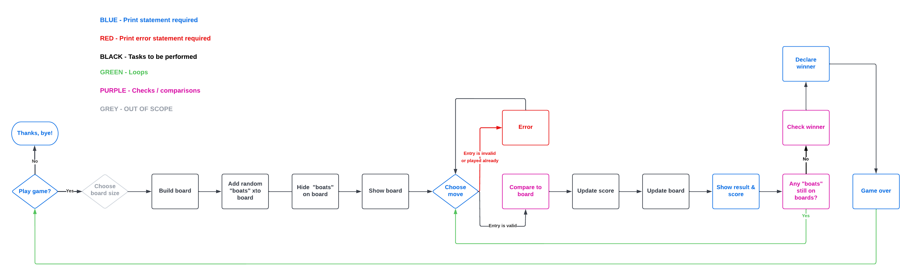

# Welcome to You Sunk My Battleship

You Sunk My Battleshp is a tribute to the popular traditional game of <a href="https://en.wikipedia.org/wiki/Battleship_(game)#:~:text=Battleship%20is%20known%20worldwide%20as,device%20apps%20and%20a%20film">Battleships</a>, the ultimate in simple strategy gaming.

Battleships can be played with just a paper and pen but it has grown into much more since it's inception during World War I. Now expanded to board games, electronic games and even a film, it is an enduring classic. This version offers a basic version in which the player must try and "sink" the ships on the board by guessing their position with a limited number of turns.

This game is a demonstration of my Python skills as required by Portfolio 3 Assessment as part of the Code Institute Diploma in Full Stack Software Development.

 
<strong>The deployed game can be found <a href="??">here</a>
</strong>
 

 

## How to play

Battleships are placed on a board and hidden from the player. They must guess where on the board they think the battelship is placed. First, typing a number corresponding to the x axis then hitting enter on their keyboard. This is followed by a letter corresponding to the y axis and the enter key. If the guess is correct, they have hit and sunk a battleship!

Players are limited to 8 torpedoes (or turns) in which to try and destroy all the battleships and win teh game.

If they are successful, they will be rewarded with a surprise ASCII display. If they run out of torpedoes, they will be prompted to try again in a new game.

 

## Wireframing & Planning

Before beginning to code I used <a href="https://lucid.app/documents#/dashboard">Lucid</a> online chart builder to map out the game and how I wanted to approach it. It helped to work through the steps I needed to take to make the game make sense to the player and what tasks the code should execute.

 

 

## Features
### Existing
<ul>
<li>Generates board</li>
<li>Places battleships in random positions on board</li>
<li>Keeps score</li>
<li>Limit player turns</li>
</ul>
 

### Future
<ul>
<li>Boat number/board size choice</li>
<li>Two player mode</li>
<li>Custom player naming</li>
</ul>
 

## Data Model

For this game, two classes were used; one for the board and one for the ships. Using two classes for main elements of the game should allow for additional features to be added later without disrupting the way the game currently runs.

### BattleshipBoard

This class is used to generate the board during the gameplay. As the player adds their guesses to the board it's used up to 8 times in one game.

 

### Battleships

This class handles the position of the ships on the board and the players entries including validation and checking if the turn was a "hit". Similar to the BattleshipBoard class, Battleship is used at least 8 times, more if the user repeatedly enters an incorrect value when guessing.

 

## Testing
### PEP8

PEP8 is the industry standard that provides guidelines for styling Python code. It helps to keep programmes written in Python legible and maintainable. This project was validated using PEP8 for Python 3.

 

### Gitpod

Using Gitpod as my worksapce provided additional support when building this game. It flags errors and potential areas to improve as the user writes the code. This was particularly useful for ensuring indentation and line length were up to PEP8 standard as the project developed.

 

### Online PEP8 checkers

In addition to Gitpod, I used several online tools such as <a href="https://extendsclass.com/python-tester.html">Extends Class</a> to back up my validation. However, a couple of them were dated and checking against older Python versions. This initially caused some confusion as they flagged code that was currently correct, such as the use of f-strings. Once I realised my mistake a rechecked using the appropriate version and found no significant errors.

 

### Code Institute / Heroku

final testing, mostly line lengths

 

## Deployment

This project was deployed using <a href="https://dashboard.heroku.com/apps">Heroku</a> Cloud Platform. To replicate the deployment, please follow the below steps.

### Steps for Deployment
<ul>
    <li>??</li>
</ul>
 

## Credits
### Background Support & Referencing:
<ul>
    <li><a href="https://learn.codeinstitute.net/courses/course-v1:CodeInstitute+PE_PAGPPF+2021_Q2/courseware/b3378fc1159e43e3b70916fdefdfae51/605f34e006594dc4ae19f5e60ec75e2e/">Portfolio Project 3 Scope</a> through Code Institute</li>
    <li><a href="https://www.youtube.com/watch?v=alJH_c9t4zw">Python Battleship with Object Oriented Programming</a> by Knowledge Mavens through Youtube</li>
    <li><a href="https://copyassignment.com/battleship-game-code-in-python/">Battleship Game Code in Python</a> by Pranjav Dev through Copy Assignment</li>
    <li><a href="https://bigmonty12.github.io/battleship">Python for Beginners: Battleship2</a> by Austin Montgomery through BigMonty1.github.io</li>
</ul>
 

### Direct Sourcing:
<ul>
    <li><a href="https://www.geeksforgeeks.org/python-ascii-art-using-pyfiglet-module/">Python ASCII art using Pyfiglet Module</a> by Ankthon through Geek for Geeks - This appeared to be a straight forward method of inserting ASCII art into my project and there doesn't appear to be justification for changing or complicating it.</li>
    <li><a href="https://www.youtube.com/watch?v=alJH_c9t4zw">Python Battleship with Object Oriented Programming</a> by Knowledge Mavens through Youtube - This tutorial helped resolve two issues I couldn't get past on my own. The first was formatting the board with an f-string. Although all the characters were working, the layout of the board was broken. I'm unsure if the formatting placeholders are actually the optimal approach but they were the working one at the time of submission. Secondly, after putting together the elements of the game, I couldn't get it to run. After rechecking the definitions and functions using print statements to the console, I reviewed this solution and I realised I was missing the main function to run the script.</li>
<ul>